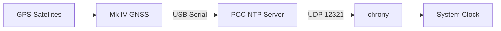

# PCC (Precision Clock Companion)

A native macOS companion app for the [Precision Clock Mk IV](https://mitxela.com/projects/precision_clock_mk_iv/docs) by [mitxela](https://mitxela.com). Lives in the menu bar — connects over USB serial to drive the clock's display, track satellites, serve GPS-disciplined NTP time, and scroll WeatherKit conditions.

> [!NOTE]
> This is an independent, community-built companion app. Not affiliated with mitxela.

> [!TIP]
> Also available as **[PCC Web](https://peterlewis.github.io/pcc/web/)** — browser build for Chromium. WIP / POC, things may not work. See [below](#pcc-web-wip--poc).

   

## Screenshots

<picture>
  <source media="(prefers-color-scheme: dark)" srcset="docs/screenshots/satellites-polar-dark.png">
  
</picture>

<table>
<tr>
<td>
<picture>
  <source media="(prefers-color-scheme: dark)" srcset="docs/screenshots/data-sources-dark.png">
  
</picture>
<br><sub>Data Sources</sub>
</td>
<td>
<picture>
  <source media="(prefers-color-scheme: dark)" srcset="docs/screenshots/satellites-polar-dark.png">
  
</picture>
<br><sub>Satellites — Polar</sub>
</td>
<td>
<picture>
  <source media="(prefers-color-scheme: dark)" srcset="docs/screenshots/satellites-map-dark.png">
  
</picture>
<br><sub>Satellites — Map</sub>
</td>
</tr>
<tr>
<td>
<picture>
  <source media="(prefers-color-scheme: dark)" srcset="docs/screenshots/brightness-dark.png">
  
</picture>
<br><sub>Brightness</sub>
</td>
<td>
<picture>
  <source media="(prefers-color-scheme: dark)" srcset="docs/screenshots/weather-dark.png">
  
</picture>
<br><sub>Weather</sub>
</td>
<td>
<picture>
  <source media="(prefers-color-scheme: dark)" srcset="docs/screenshots/time-server-dark.png">
  
</picture>
<br><sub>Time Server</sub>
</td>
</tr>
</table>

<details>
<summary>All screenshots</summary>
<br>

<table>
<tr>
<td>
<picture>
  <source media="(prefers-color-scheme: dark)" srcset="docs/screenshots/connect-dark.png">
  
</picture>
<br><sub>Connect</sub>
</td>
<td>
<picture>
  <source media="(prefers-color-scheme: dark)" srcset="docs/screenshots/data-sources-dark.png">
  
</picture>
<br><sub>Data Sources</sub>
</td>
<td>
<picture>
  <source media="(prefers-color-scheme: dark)" srcset="docs/screenshots/text-dark.png">
  
</picture>
<br><sub>Text</sub>
</td>
</tr>

<tr>
<td>
<picture>
  <source media="(prefers-color-scheme: dark)" srcset="docs/screenshots/data-sources-rest-dark.png">
  
</picture>
<br><sub>Data Sources — REST</sub>
</td>
<td>
<picture>
  <source media="(prefers-color-scheme: dark)" srcset="docs/screenshots/data-sources-bash-dark.png">
  
</picture>
<br><sub>Data Sources — Bash</sub>
</td>
<td>
<picture>
  <source media="(prefers-color-scheme: dark)" srcset="docs/screenshots/countdown-dark.png">
  
</picture>
<br><sub>Countdown</sub>
</td>
</tr>

<tr>
<td>
<picture>
  <source media="(prefers-color-scheme: dark)" srcset="docs/screenshots/satellites-polar-dark.png">
  
</picture>
<br><sub>Satellites — Polar</sub>
</td>
<td>
<picture>
  <source media="(prefers-color-scheme: dark)" srcset="docs/screenshots/satellites-map-dark.png">
  
</picture>
<br><sub>Satellites — Map</sub>
</td>
<td>
<picture>
  <source media="(prefers-color-scheme: dark)" srcset="docs/screenshots/satellites-globe-dark.png">
  
</picture>
<br><sub>Satellites — Globe</sub>
</td>
</tr>

<tr>
<td>
<picture>
  <source media="(prefers-color-scheme: dark)" srcset="docs/screenshots/modes-dark.png">
  
</picture>
<br><sub>Modes</sub>
</td>
<td>
<picture>
  <source media="(prefers-color-scheme: dark)" srcset="docs/screenshots/diagnostics-dark.png">
  
</picture>
<br><sub>Diagnostics</sub>
</td>
<td>
<picture>
  <source media="(prefers-color-scheme: dark)" srcset="docs/screenshots/serial-monitor-dark.png">
  
</picture>
<br><sub>Serial Monitor</sub>
</td>
</tr>

<tr>
<td>
<picture>
  <source media="(prefers-color-scheme: dark)" srcset="docs/screenshots/advanced-dark.png">
  
</picture>
<br><sub>Advanced</sub>
</td>
<td>
<picture>
  <source media="(prefers-color-scheme: dark)" srcset="docs/screenshots/updates-dark.png">
  
</picture>
<br><sub>Updates</sub>
</td>
<td></td>
</tr>


</table>
</details>

## Features

### Display & Configuration
- Connects over serial, auto-detects ports, reconnects after reboot
- Configure display modes, colon animation, brightness curve, diagnostics, timezone, and more
- Send text or countdowns to the display
- Poll REST APIs or shell commands and rotate values on the clock (with HTTP header support)
- Edit the 5-point brightness curve with a draggable graph; save custom presets
- Read and write `config.txt` with local backups kept on the Mac
- Check for firmware and timezone updates; install to the <kbd>CLOCK</kbd> USB volume (auto-ejects after copy so the mass-storage write cache is flushed before reconnect)

### GPS & Satellites
- Three satellite views — Polar plot, world Map, and interactive 3D Globe — with consistent toggles for satellites, labels, and trails
- Per-pass trail recording: each satellite's continuous arc is captured as a distinct pass, rendered through five age tiers (live → recent → today → week → archive) with live passes glowing and older ones fading
- Adaptive moving-average smoothing on trails so older passes read as clean arcs rather than noisy dotting
- Time-window filter: scrub trails by recency — Live, 5m, 15m, 1h, 6h, 24h, 7d, 30d, or All — consistent across all three views
- Crash-safe persistence: atomic per-observation writes; retention configurable from 1 hour to unlimited (30-day default); brief signal drop-outs (< 5 min) rejoin the prior pass rather than splitting the trail
- Sector heatmap (u-center style): peak SNR per 5° × 5° sky cell, navy → purple → warm-red ramp — toggleable on the polar view
- GPS info: coordinates, Maidenhead grid locator, altitude, HDOP[^1], fix type, satellites used
- Celestial data: sun rise/set, solar noon, golden hour, civil twilight; moon phase, illumination, altitude, azimuth
- Signal analysis with diagnostics panel
- GPS Insights: on-device AI (Apple Foundation Models) summarises siting, signal quality, and reception trends from accumulated pass history — private, offline, no API key

### NTP Time Server
- Basic Stratum 1 server on `localhost:12321`, disciplined by the clock’s GNSS module — see [setup below](#ntp-time-server)

### Weather
- Conditions scrolled on the clock via WeatherKit; GPS-derived location, configurable update interval

### Other
- Serial monitor for raw NMEA and debug output

## PCC Web (WIP / POC)

> [!WARNING]
> Proof-of-concept. Work in progress. Things may not work. Use the Mac app for anything you rely on.

Browser build of PCC for Chromium-based browsers (needs Web Serial). **[Open PCC Web](https://peterlewis.github.io/pcc/web/)** · details in [web/README.md](web/README.md) · Swift ↔ JS mirror conventions in [MAC_PARITY.md](MAC_PARITY.md).

Can't do: NTP server, firmware/timezone updates, native map, WeatherKit, AI insights — each needs something browsers don't give.

### Run locally

```bash
git clone https://github.com/peterlewis/pcc.git
cd pcc
bash web/serve.sh     # localhost:8765
```

Web Serial works on `localhost` without HTTPS; any other host needs HTTPS.

## Building

Requires macOS 26+ and a Precision Clock Mk IV connected via USB.

```bash
git clone https://github.com/peterlewis/pcc.git
cd pcc
swift build
swift run PCC
```

Or open `Package.swift` in Xcode and hit <kbd>⌘</kbd><kbd>R</kbd>.

## NTP Time Server

Enable from the Time Server tab. The NTP server is a localhost convenience tool — there is no holdover oscillator, so if GPS fix is lost it falls back to system time without adjusting stratum.

> [!NOTE]
> Not a production time source, and not intended as a network-facing server. Designed as a localhost source for chrony while GPS fix is held.



<details>
<summary>Pairing with chrony</summary>
<br>

Install [chrony](https://chrony-project.org/):

```bash
brew install chrony
```

Add to `/opt/homebrew/etc/chrony.conf`:

```
server 127.0.0.1 port 12321 iburst prefer
```

Start chrony:

```bash
sudo mkdir -p /var/run/chrony
sudo /opt/homebrew/sbin/chronyd -f /opt/homebrew/etc/chrony.conf
```

Check status with `chronyc tracking`. You should see Stratum 1 with reference ID `GPS`.

> [!IMPORTANT]
> chrony requires elevated privileges to discipline the system clock. PCC’s NTP server runs unprivileged on a non-standard port.

</details>

## Serial protocol

<details>
<summary>Protocol details</summary>
<br>

Commands are `key = value\r\n` over USB serial at 115200 baud. They take effect immediately but reset on power cycle unless saved to `config.txt`. The app disables NMEA output on connect so commands work reliably, and restores it on disconnect. See the [Mk IV documentation](https://mitxela.com/projects/precision_clock_mk_iv/docs) for the full command reference.

> [!CAUTION]
> Writing to config.txt overwrites the clock’s saved settings. PCC keeps a local backup on each write, but take care with manual serial commands.

</details>

## Dependencies

| Dependency | Type | Purpose |
|---|---|---|
| [ORSSerialPort](https://github.com/armadsen/ORSSerialPort) | SPM | USB serial communication |
| [globe.gl](https://globe.gl) | Bundled | Interactive 3D globe view (MIT, served offline from `Resources/Globe/`) |
| [three.js](https://threejs.org) / [three-globe](https://github.com/vasturiano/three-globe) | Bundled | Day/night `ShaderMaterial` and sphere layers (MIT, bundled transitively inside `globe.gl.min.js`) |
| NASA Blue Marble / Earth's City Lights | Bundled | Day and night Earth textures (public domain, redistributed via three-globe) |
| MapKit | Apple framework | Satellite world-map view (Apple Maps) |
| WeatherKit | Apple framework | Weather data |

Full license texts for bundled third-party code and assets are in [`THIRD_PARTY_LICENSES.md`](THIRD_PARTY_LICENSES.md).

## Related

- [Precision Clock Mk IV](https://mitxela.com/projects/precision_clock_mk_iv/docs): official project documentation
- [clock4](https://github.com/mitxela/clock4): hardware design and firmware source
- [Forum thread](https://mitxela.com/forum/topic/pcc-precision-clock-companion-macos-menu-bar-app): discussion on the mitxela forum

[^1]: HDOP (Horizontal Dilution of Precision) indicates the geometric quality of the satellite constellation. Lower is better; < 1.0 is excellent, > 5.0 is poor.
